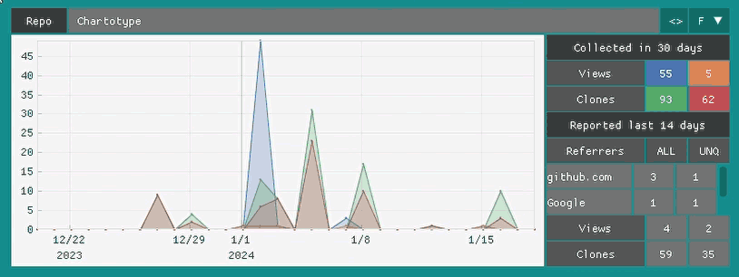

  
# KipHub Traffic  
*v2.0*  

My take on the "GitHub doesn't save more than 14 days of traffic data" problem.    
There are a lot of similar tools out there but all of them seemed a bit overworked for my taste so I ~~took the usual approach and~~ made ~~a simpler~~ one with chicken wire and bubble gum. 
  
KipHub Traffic uses the GitHub API to recover traffic data from your repositories, saves them locally, bypassing the 14 days limit, and displays them on a pleasing and more useful way.  
  
> KipHub Traffic still supports [command line](#KipHub_Traffic_Command_Line) operation only without needing Dear PyGui.   
  
## KipHub Traffic GUI  
### Getting started
To use the GUI you must have the [Dear PyGui module](https://github.com/hoffstadt/DearPyGui) installed.  
  
When running for the first time, KipHub Traffic will ask for a GitHub username.   
After that you must enter a valid, current GitHub API token with access to repository info.  
  
> Get the token on the GitHub page at `Settings > Developer settings > Personal access tokens (classic)` ticking the `repo` checkmark.  
  
You can now download the GitHub data on `Menu > Settings > Fetch from GitHub`.  
This is where you download updated GitHub data whenever you need.  
  
> Remember, the whole purpose of this program is to keep track of the data past the 14 days maximum on the GitHub page, so always fetch the data on intervals shorter than this period.  
  
### The interface  
  
  
The interface is composed of a menu bar, a header, a repository body and footer.  

#### The Menu
The menu offers complimentary actions to help the use of KipHub Traffic.  
The `File` menu deals mostly with configuration. Most of the configuration done on KipHub Can be saved and restored later. You can create several custom configurations according to your taste or to better view certain aspects of the information in a way or another.  
You can revert the configuration to the default one. Open a specific configuration file, quick open previously saved configurations, save a default configuration and save the current configuration to a different configuration file. Here you can also `Exit` the program.  
The `Settings` menu is where you can enter a new token for the user (creating expiring tokens is a good practice), fetch new data from GitHib, amd show the API usage ratios. Here you can also configure some more obscure settings like small and large gaps show between the boards (`Basic` and `Graph` boards use the small separator, the rest use the large one), the delay of the tooltips (all in `Deep Config`), restore the width of the interface to the default size and enable or disable the tooltips.  
In the `Info` menu you have information about KeepHub Traffic, a help window and you can display statistics about the repositories regarding the current period.  
The statistic window show the most hits on a day and the average daily hits for each category (View All, View Uniques, Clones All, Clones Uniques) in the current period. It also show compiled information regarding all repositories. `Average average` show the average for all days averages and `Sum average` shows the sum of all hits averaged for the period. You can call several statistic windows for different periods for comparison.  
  
   

#### The Header  
The header shows the username, the amount of repositories under that user, the last date the data was updated, how many days ago was the update (remember, after 14 days you start to lose data. the program will highlight this number in yellow and then in red to warn about the deadline), the first day of the shown data, the last day of the period and how many days are being shown.  
You can change the initial and final dates by clicking on their labels (they cannot go earlier or later than the available data). Enter the date by clicking on the date widget or by entering a date below. The date format is `y-m-d`, `m-d`, or only `d`. The current period will be taken for the omitted ones. Years can have 2 or 4 digits.  
Clicking in the days period will bring some options:  
`Disabled` will turn on or of the enforcing of how many days are shown. If the period is enabled (unchecked) the current period of days entered will almost always be enforced (some actions might disable or enable this without notification).  
`Last day` will take the ending date to the last date available.  
The slider under `Last day` will set the desired period to show (this will only take effect when the period is enabled). Control/Command clicking this allows for manual entry.  
`All days` takes the initial and final date to the earliest and latest available dates on the data, showing all available days at once.  
  
#### The Body
The body show boards with information about each repository. They can be `Basic`, `Graph`, `Under`, `Compact`, `Referrer`, `Full`.  
The position of the information is different on each board ans not all of them show all information available.  
The boards have a header with the name of the repository, a button `<>` to send the date period of this board (when zoomed) to all boards, and a combo box to change the type of this board.  
GitHub provides information about the views and clones of each repository. This information is further detailed in 'all' and 'uniques'. All is the total amount of views or clones on the repository. Uniques are the how many unique persons viewed or cloned the repository. All and Uniques are represented by `ALL` and `UNQ`.   
GitHub provides information in two ways, a daily report detailing numbers for each day and a reported sum of the last 14 days (these numbers not always match). KipHub Traffic show all this information for comparison. GitHub also report the referrers (where visitors came from) from the last 14 days, all and unique, this information is also shown.  
The daily collect data is color coded, View All is blue, View Uniques is orange, Clones All is green and Clones Uniques is red. You can click on each color to toggle each graphic view on the plot.  
The plot can be manipulated in a number of ways. It can be dragged in all directions, can be zoomed in or out with the mouse wheel (placing the mouse on the X or Y labels while zooming will affect only this axis), double click will reset the view and the right mouse button can be used to drag a region to zoom or to call a menu with several options.  
  
  
  
#### The Footer
The footer is mostly about configuring the viewing of the information. There are combo boxes to change all boards to a certain type, a combo box with several options to sort the repositories (there is an entry to `Revert` the sorts), toggles for all four graphics that affects all repositories, button to configure the plots where you can change the intensity of the graphics fill, the height of the plots and if you want to see the dates on the X axis. There is also a filter box where you can enter text to filter which repositories are shown. A box next to it have all repository names as a shortcut for the filter and there is a button to clear the filter box.  

### Resetting the User
If you want reset the user on KipHub Traffic, you must delete (or backup) all files inside `\JSONs` and run KipHub Traffic Again.  
A multi user version might come in the future.  

## KipHub Traffic Command Line  
This is now the real simple one.  
> You can use the 2.0 GUI version with a `-g` argument or just use the 1.2 version.

KipHub Traffic Command Line uses no external dependencies and no servers, you just have to run it once every fourteen days and you are done. It even manages to produce a passable visual representation of the data with lots of options.  
  
Each repository will be listed with information about `referrers`, `views` and `clones` each with `count` and `uniques` . If the information is not available its section will be omitted:  
```  
Repo: msx-basic-dignified  
Referrers: (last 14 days)  
 github.com C10 U2  
 msx.org C4 U2  
 Google C2 U1  
Views: C26 U8 (last 14 days)  
 Day: 20 21 22 23 24 25 26 27 28 29 30 31|01 02 03 04 05 06 07 08  Sum  
 Cnt:          3     13                   1  5  15 4     1         42  
 Unq:          2     1                    1  1  4  1     1         11  
Clones: C2 U2 (last 14 days)  
 Day: 20 21 22 23 24 25 26 27 28 29 30 31|01 02 03 04 05 06 07 08  Sum  
 Cnt:          1     1     1  1                                    4  
 Unq:          1     1     1  1                                    4  
```  
The values show in `Referrers`, `Views` and `Clones` are given as is by GitHub and are only for the past 14 days. `C` stands for `count` and `U` for `uniques`.  `|` marks a new month and `Sum` shows the total amount for the period.  
  
The information shown can be customized in a number of ways with toggles to hide any information not needed, these include hiding days without data, referrers (which can be show on a single line or expanded), the views and clones 14 days reports, the days and sum labels, the daily data, the sum and the whole views, clones, count or unique sections.  
Showing for instance:  
```  
Repo: msx-basic-dignified  
Clones:  
 Cnt:  54  
 Unq:  40  
```  
You can customize the repository sort order (ascending or descending) based on its `name` (*default*), `views`, `clones` and then by `count` and `uniques`.  
  
The dates shown can also be customized. By default it will display the last 30 available days but you can choose a starting date, an ending date or a period ranging back from the ending date.  
  
The API data is consolidated and saved on a JSON file with the GitHub login name. When downloading data and updating the JSON database a backup of the previous one will be created.  All created files are saved on the `JSONs` folder.  
  
You can also specify if you want to keep the API response (each on its own JSON file) and even if you want to reuse these data instead of the main JSON database or the API's.  
  
There is no built in option to save the output to a text file but you can pipe the output to a text file by using `> output.txt` after the commands.  
  
There are some predefined `.bat` files for Windows users to call KipHub Traffic with custom settings.  
```  
KipHub_DOWN.bat  
KipHub_VIEW.bat  
KipHub_VIEW_AllDays.bat  
KipHub_VIEW_AllInfo.bat  
KipHub_VIEW_ClonesUnique.bat  
KipHub_VIEW_Referres.bat  
```  
### How to use  
  
**KipHub Traffic** uses the personal access token from the GitHub API.  
  
> Get the token at `Settings > Developer settings > Personal access tokens` ticking the `repo` checkmark.  
  
Assign your `token` and `username` to the appropriated variables in the code:  
  
``` python  
username = '<YOUR_USERNAME>'  
token = '<YOUR_TOKEN>'  
```  
  
And run it with:  
`KipHub.py [args] [> output.txt]`  
  
The program will call the GitHub API, get your repository list and go through each one of them collecting their traffic data and consolidating them on a single JSON. This JSON is your long term traffic storage, if there is one present, **KipHub** will load it and merge the new data.  
  
> There must be a folder called `JSONs` at the level of `KipHub.py`.  
  
**There are several arguments you can use to customize the output:**  

`-g` (v2.0)  
Use this argument to run KipHub Traffic v2.0 on command line mode.  
  
`-m`  
By default KipHib Traffic will output colors to the console.  
Use this if your console is not compatible with the KipHub Traffic colors.  
  
`-d`  
By default KipHib Traffic only display the available data.  
Use this to download new data from GitHub.  
  
`-c [k,u]`  
*Cache behavior.*  
KipHub Traffic can keep the API response JSONs as local files. This changes the way it is used and kept.  
`k`: keep a local copy of the API response JSONs.  
`u`: do not go online, use the local copy of the API JSONs to update the database and show the data.  
Default: do not save the API JSONs nor use it.  
  
`-b <date>`  
*Custom **start** date.*  
The format must be `y-m-d`, `m-d` or just `d`.  
Default: the first date available across all repos.  
  
`-e <date>`  
*Custom **end** date.*  
The format must be `y-m-d`, `m-d` or just `d`.  
Default: the date last updated.  
  
`-p <days>`  
*Period.*  
Number of days to show before the **end** date (overrides `-b`).  
Default: none  
  
`-s [v,c,o,r]`  
*Sorting order.*  
Changes the sort order.  
You can use more than one letter to refine the sort.  
`v`: sort by `views`.  
`c`: sort by `clones`  
The default secondary sort is by `uniques`  
`o`: sort secondary by `count`.  
`r`: reverse the sort order.  
Default: alphabetically by repo name.  
  
`-t [a,r,e,p,l,d,s,v,c,o,u]`  
*Toggle view elements.*  
Configures the way the data is show.  
You can use more than one letter to refine the output.  
`a`: hide all days without data.  
`r`: hide the `referrers`  
`e`: `referrers` are show all on the same line, this expands them to one line each.  
`p`: hide the reported 14 days `count` and  `unique` for `views` and `clones`.  
`l`: hide the label for the days and sums.  
`d`: hide the daily information.  
`s`: hide the sum.  
`v`: hide the `views`.  
`c`: hide the `clones`.  
`o`: hide the `count`  
`u`: hide the `unique`.  
Default: show everiything.  
Obs. these are toggles so you can set a default in the variable `toggle = ''` on the code and toggle back the information when needed.  
  
`> output.txt`  
*Save output.*  
Use at the end of the command.  
Saves a copy of the output to a text file.  
  
  
## Acknowledgements  
  
Enjoy and send feedback.  
***KipHub Traffic** is offered as is, with no guarantees whatsoever.*  
